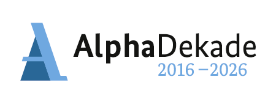
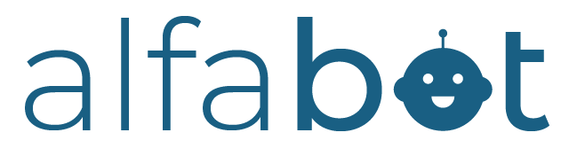

# Einführung und Ziele

**ALFA-Bot** ist ein Verbundvorhaben, das im Rahmen der [Alphadekade](https://www.alphadekade.de/) vom BMBF gefördert wird.

Die Alphadekade ist ein bundesweites Kooperationsbündnis der Bundesregierung und der Länder, um 
funktionalem Analphabetismus Aufmerksamkeit zu verleihen und Wege zu finden, Betroffenen zu helfen.
6.2 Mio Menschen im erwerbsfähigen Alter weisen eine geringe Literalität auf. Diesen Anteil von etwa 10% der gesamten Bevölkerung
im arbeitsfähigen Alter zu reduzieren ist eine Herausforderung, die nur durch die ganze Gesellschaft erfolgreich
bewältigt werden kann. 

Im dreijährigen Projekt **ALFA-Bot** geht es darum, zu ergründen, ob Chatbot-basierte Angebote, wie die im Projekt 
zu entwickelnde Smartphone App, geeignet sind, um Betroffene der Alpha-Level 1-3 anzusprechen, ihnen einen Mehrwert zu bieten
und sie im besten Fall dazu motivieren können, professionelle Hilfsangebote aufzusuchen.

## Aufgabenstellung

Kernelemente im Projekt ALFA-Bot nach folgenden Stichpunkten:
* Zugrunde liegende Geschäftsziele: Entwicklung einer App im fortgeschrittenen Prototypen-Status, um die Anforderungen des Fördergebers gemäß Ausschreibung zu erfüllen.
* Wesentliche Aufgabenstellungen: Entwicklung einer Chatbot-App für gering literalisierte Menschen, um diesen sowohl lebensweltlich hilfreichen Inhalt als auch Bildungsangebote anbieten zu können. Anhand dieser App soll überprüft werden, ob diese Technologie ein hilfreiches Mittel sein kann, um diese spezielle Zielgruppe anzusprechen
* Wesentliche funktionale Anforderungen: Die App muss für Android und iOS verfügbar sein, Design und Inhalte müssen im Hinblick auf gering literalisierte Menschen so barrierearm wie möglich sein.

<!--
**Inhalt**

Kurzbeschreibung der fachlichen Aufgabenstellung, treibenden Kräfte,
Extrakt (oder Abstract) der Anforderungen. Verweis auf (hoffentlich
vorliegende) Anforderungsdokumente (mit Versionsbezeichnungen und
Ablageorten).

**Motivation**

Aus Sicht der späteren Nutzung ist die Unterstützung einer fachlichen
Aufgabe oder Verbesserung der Qualität der eigentliche Beweggrund, ein
neues System zu schaffen oder ein bestehendes zu modifizieren.

**Form**

Kurze textuelle Beschreibung, eventuell in tabellarischer Use-Case Form.
Sofern vorhanden, sollte die Aufgabenstellung Verweise auf die
entsprechenden Anforderungsdokumente enthalten.

Halten Sie diese Auszüge so knapp wie möglich und wägen Sie Lesbarkeit
und Redundanzfreiheit gegeneinander ab.

Siehe [Anforderungen und Ziele](https://docs.arc42.org/section-1/) in
der online-Dokumentation (auf Englisch!).
-->

## Qualitätsziele

Bei der Entwicklung der App liegt besonderer Fokus auf der *funktionalen Eignung und Gebrauchstauglichkeit*, 
der *Wartbarkeit und Adaptionsfähigkeit*, sowie *Skalierbarkeit*.

Gute *Gebrauchstauglichkeit* ist nicht nur eine Frage der Höflichkeit und des Respekts gegenüber den Nutzer:innen.
In Zeiten der zunehmenden Informationsüberflutung geht es immer mehr darum, 
digitale Anwendungen benutzerfreundlicher zu gestalten, um eine App erfolgreich zu betreiben.
Die Erreichung dieser Ziele werden mit regelmäßigen Usability-Tests überprüft. Zudem soll die App sowohl von Nutzenden mit Android- 
als auch mit iOS-Geräten genutzt werden können. Um dieses Ziel mit den vorhandenen Ressourcen erreichen zu können, wird 
ein Framework verwendet, welches aus einer Codebasis native Apps für beide Systeme herstellen kann.

Unter *Wartbarkeit und Adaptionsfähigkeit* versteht das Projekt, dass die Inhalte des Chatbots auch von redaktionellen Mitarbeitenden
geändert und erweitert werden können. Ebenso soll der Bot leicht anpassbar sein, um in anderen Kontexten mit geringem Aufwand
wiederverwendet werden zu können, bspw. für politische Wahlen.
Insbesondere das Ziel der Wartbarkeit lässt sich voraussichtlich nur in Ansätzen im Rahmen der Projektlaufzeit erreichen.

Die *Skalierbarkeit* soll gewährleisten, dass die App nach der Veröffentlichung auch auf andere 
Dorf übertragen werden kann. Um dieses Ziel zu erreichen
wurde auf eine moderne Container-Architektur gesetzt, die die Verfügbarkeit der Dienste schnell auf ein benötigtes Maß erhöht

<!--
**Inhalt**

Die Top-3 bis Top-5 der Qualitätsanforderungen für die Architektur,
deren Erfüllung oder Einhaltung den maßgeblichen Stakeholdern besonders
wichtig sind. Gemeint sind hier wirklich Qualitätsziele, die nicht
unbedingt mit den Zielen des Projekts übereinstimmen. Beachten Sie den
Unterschied.

Hier ein Überblick möglicher Themen (basierend auf dem ISO 25010
Standard):

**Motivation**

Weil Qualitätsziele grundlegende Architekturentscheidungen oft
maßgeblich beeinflussen, sollten Sie die für Ihre Stakeholder relevanten
Qualitätsziele kennen, möglichst konkret und operationalisierbar.

**Form**

Tabellarische Darstellung der Qualitätsziele mit möglichst konkreten
Szenarien, geordnet nach Prioritäten.

-->

## Stakeholder

| Rolle                                                         | Kontakt                                                                                                              | Erwartungshaltung                                                                                                                                  |
|---------------------------------------------------------------|----------------------------------------------------------------------------------------------------------------------|----------------------------------------------------------------------------------------------------------------------------------------------------|
| Fördergeber Bundesministerium für Bildung und Forschung       | Forschungsergebnisse im Hinblick auf die Ansprachemöglichkeit gering literalisierter Menschen mithilfe von Chatbots. |
| Vorstandmitglied GuD und Antragsteller für ALFA-Bot           | Prof. Gernot Bauer                                                                                                   | Erfolgreiche Umsetzung des Gesamtprojekts ALFA-Bot gemäß Vorhabenbeschreibung.                                                                     |
| Vorstand Bundesverband Alphabetisierung und Grundbildung e.V. | Ralf Häder                                                                                                           | Neue praxistaugliche Hilfsmittel, um Betroffenen aus der Zielgruppe helfen zu können und Kursleitende von Alphabetisierungskursen zu unterstützen. |

