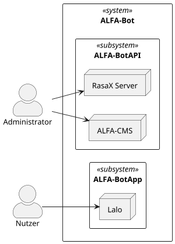

# Kontextabgrenzung

<!--
**Inhalt**

Die Kontextabgrenzung grenzt das System von allen
Kommunikationsbeziehungen (Nachbarsystemen und Benutzerrollen) ab. Sie
legt damit die externen Schnittstellen fest.

Differenzieren Sie fachliche (fachliche Ein- und Ausgaben) und
technische Kontexte (Kanäle, Protokolle, Hardware), falls nötig.

**Motivation**

Die fachlichen und technischen Schnittstellen zur Kommunikation gehören
zu den kritischsten Aspekten eines Systems. Stellen Sie sicher, dass Sie
diese komplett verstanden haben.

**Form**

Verschiedene Optionen:

-   Diverse Kontextdiagramme

-   Listen von Kommunikationsbeziehungen mit deren Schnittstellen

Siehe [Kontextabgrenzung](https://docs.arc42.org/section-3/) in der
online-Dokumentation (auf Englisch!).
-->

## Fachlicher Kontext

<!--
**Inhalt**

Festlegung **aller** Kommunikationsbeziehungen (Nutzer, IT-Systeme, …)
mit Erklärung der fachlichen Ein- und Ausgabedaten oder Schnittstellen.
Zusätzlich (bei Bedarf) fachliche Datenformate oder Protokolle der
Kommunikation mit den Nachbarsystemen.

**Motivation**

Alle Beteiligten müssen verstehen, welche fachlichen Informationen mit
der Umwelt ausgetauscht werden.

**Form**

Alle Diagrammarten, die das System als Blackbox darstellen und die
fachlichen Schnittstellen zu den Nachbarsystemen beschreiben.

Alternativ oder ergänzend können Sie eine Tabelle verwenden. Der Titel
gibt den Namen Ihres Systems wieder; die drei Spalten sind:
Kommunikationsbeziehung, Eingabe, Ausgabe.

**&lt;Diagramm und/oder Tabelle>**

**&lt;optional: Erläuterung der externen fachlichen Schnittstellen>**
-->

Das ALFA-Bot-System teilt sich in zwei Subsysteme auf:

- ALFA-BotAPI
- ALFA-BotApp

Das Frontend für die Nutzenden ist die ALFA-Bot-App *Lalo*. Hier haben die Nutzenden
die Möglichkeit, mit dem Chatbot in natürlicher Sprache zu kommunizieren. Dafür können sie wahlweise
den Text eintippen oder einsprechen. Die Antworten des Bots sind sowohl textuell als auch per Audiausgabe verfügbar. 
Zusätzlich hat der Bot die Möglichkeit, Bilder anzuzeigen und *Quick Reply Buttons* an seine Antwort anzuhängen, um so
Vorschläge für weitere Fragen zu liefern.

Der Administrator hat Zugriff auf die WebUI von [Rasa X](https://rasa.com/rasa-x/) (Anmerkung: Ab dem 08.06.2022 stellt
rasa die freie Community Edition von Rasa X vollständig ein. Hier können Dialoge von Nutzenden eingesehen und das 
Chatbot-Modell trainiert werden.

Nebenbei hat der Administrator Zugriff auf das [ALFA-Bot-CMS](https://alfacms.se-labor.de) ([Wordpress](https://wordpress.org))),
das neben den Mediadateien für den Chatbot auch die Projektwebseite bereitstellt.

## Technischer Kontext

<!--
**Inhalt**

Technische Schnittstellen (Kanäle, Übertragungsmedien) zwischen dem
System und seiner Umwelt. Zusätzlich eine Erklärung (*mapping*), welche
fachlichen Ein- und Ausgaben über welche technischen Kanäle fließen.

**Motivation**

Viele Stakeholder treffen Architekturentscheidungen auf Basis der
technischen Schnittstellen des Systems zu seinem Kontext.

Insbesondere bei der Entwicklung von Infrastruktur oder Hardware sind
diese technischen Schnittstellen durchaus entscheidend.

**Form**

Beispielsweise UML Deployment-Diagramme mit den Kanälen zu
Nachbarsystemen, begleitet von einer Tabelle, die Kanäle auf
Ein-/Ausgaben abbildet.

**&lt;Diagramm oder Tabelle>**

**&lt;optional: Erläuterung der externen technischen Schnittstellen>**

**&lt;Mapping fachliche auf technische Schnittstellen>**
-->

Die ALFA-Bot-App wird auf einer Codebasis für die Betriebssysteme Android und iOS entwickelt.
Der anfängliche Ansatz mit [flutter](https://flutter.dev) wurde mit dem zweiten Prototyp zur Landtagswahl NRW 2022 aufgegeben
und die App im weiteren Verlauf in [Angular](https://angular.io) entwickelt. 

Auf Backend-Seite mit API, Server und CMS kommen SpringBoot (API), Rasa X (Server) und Wordpress (CMS) innerhalb
einer Kubernetes Containerstruktur zum Einsatz.

