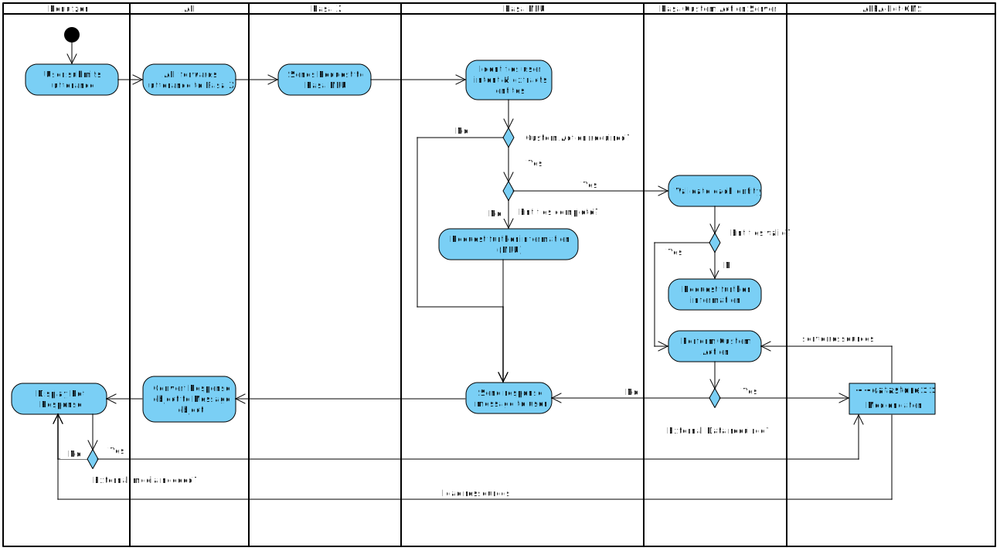

# Laufzeitsicht

<!--
**Inhalt**

Diese Sicht erklärt konkrete Abläufe und Beziehungen zwischen Bausteinen
in Form von Szenarien aus den folgenden Bereichen:

-   Wichtige Abläufe oder *Features*: Wie führen die Bausteine der
    Architektur die wichtigsten Abläufe durch?

-   Interaktionen an kritischen externen Schnittstellen: Wie arbeiten
    Bausteine mit Nutzern und Nachbarsystemen zusammen?

-   Betrieb und Administration: Inbetriebnahme, Start, Stop.

-   Fehler- und Ausnahmeszenarien

Anmerkung: Das Kriterium für die Auswahl der möglichen Szenarien (d.h.
Abläufe) des Systems ist deren Architekturrelevanz. Es geht nicht darum,
möglichst viele Abläufe darzustellen, sondern eine angemessene Auswahl
zu dokumentieren.

**Motivation**

Sie sollten verstehen, wie (Instanzen von) Bausteine(n) Ihres Systems
ihre jeweiligen Aufgaben erfüllen und zur Laufzeit miteinander
kommunizieren.

Nutzen Sie diese Szenarien in der Dokumentation hauptsächlich für eine
verständlichere Kommunikation mit denjenigen Stakeholdern, die die
statischen Modelle (z.B. Bausteinsicht, Verteilungssicht) weniger
verständlich finden.

**Form**

Für die Beschreibung von Szenarien gibt es zahlreiche
Ausdrucksmöglichkeiten. Nutzen Sie beispielsweise:

-   Nummerierte Schrittfolgen oder Aufzählungen in Umgangssprache

-   Aktivitäts- oder Flussdiagramme

-   Sequenzdiagramme

-   BPMN (Geschäftsprozessmodell und -notation) oder EPKs
    (Ereignis-Prozessketten)

-   Zustandsautomaten

-   …

Siehe [Laufzeitsicht](https://docs.arc42.org/section-6/) in der
online-Dokumentation (auf Englisch!).

## *&lt;Bezeichnung Laufzeitszenario 1>*

-   &lt;hier Laufzeitdiagramm oder Ablaufbeschreibung einfügen>

-   &lt;hier Besonderheiten bei dem Zusammenspiel der Bausteine in
    diesem Szenario erläutern>

## *&lt;Bezeichnung Laufzeitszenario 2>*

…

## *&lt;Bezeichnung Laufzeitszenario n>*

…
-->

